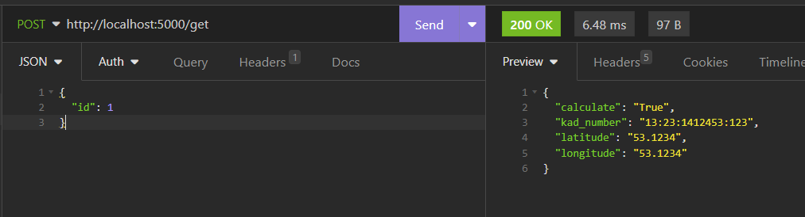

# API_Service

Для поднятия сервиса прописать `docker-compose up`

Дождаться полного развертывания БД и запуска приложения:

Запросы посылать по адресу: `localhost:5000`

Реализовано 2 метода (сделано через `POST`, дабы удобнее отправлять данные через JSON):

1. /add - добавляет новый запрос клиента, выдает ID запроса

2. /get - по ID запроса выдает результат рассчета (параметры + calculated)

Поля для метода `/add`:

1. kad_num - кадастровый номер в формате АА:ВВ:CCCCСCC:КК
2. latitude - широта
3. longitude - долгота

В случае неверного ввода полей или отсутствия таковых, возвращается `message` с ошибкой
